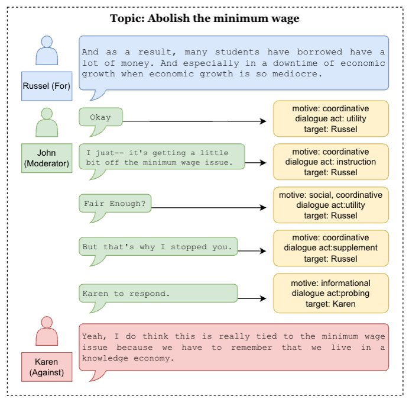
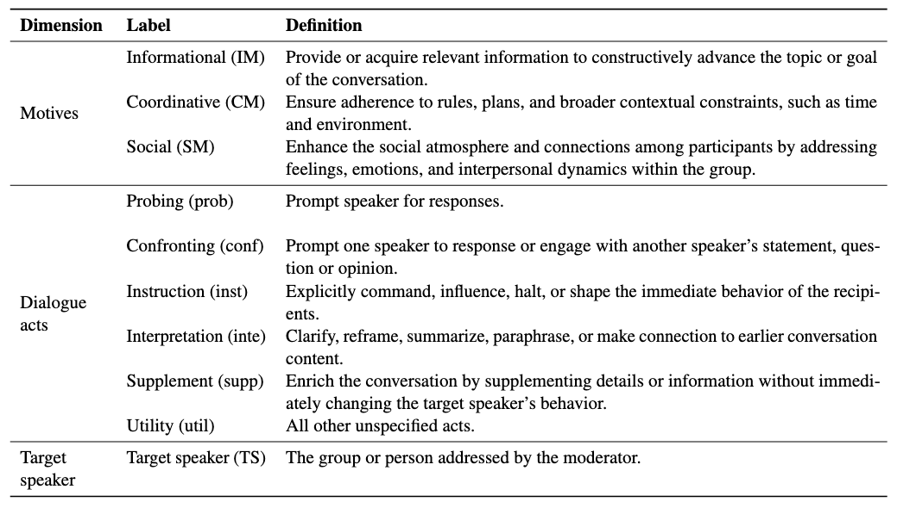
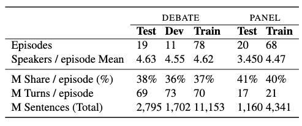

# WHoW: A Cross-domain Approach for Analysing Conversation Moderation

This repository contains information about the Whow corpus with two subsets from two different moderated conversation scenarios (Debata and Panel). The content include the description of the data, the corpus, the analysis codes, and the modelling code.

The corpus is described in Arxiv paper "WHoW: A Cross-domain Approach for Analysing Conversation
Moderation" Ming-Bin Chen and Jey Han Lau and Lea Frermann from the University of Melbourne.
https://aclanthology.org/2025.naacl-long.105/<


Example of a moderated conversation and annotation using the WHoW framework. Blue, green, and red colors represent the supporting team, moderator, and opposing team in one of the Debate subset conversation, respectively. The peach-colored boxes contain the annotations for the corresponding moderator sentences.

<br>

## The Whow Framework

We introduce WHoW: an analytical framework that breaks down the moderation decision-making process into three key components: motives (Why), dialogue acts (How), and target speaker (Who).




<br>

## The corpus and annotation

Based on the framework, we annotated moderated multi-party conversations in two domains: TV debates and radio panel discussions. Our dataset comprises a total of 5,657 human-annotated sentences (Test and Dev) and model-annotated 15,494 sentences (GPT-4o) (Train).



Descriptive statistics for the Debate and Panel. M denotes Moderator; share the proportion of words uttered by the moderator; and turn the full utterance (which contains multiple sentences).


## Dataset

All data live in the `data/` folder.  
Each corpus is split into one or more _subset_ folders that correspond to the train/dev/test splits used in our experiments.

```text
data/
├── insq/                       # Intelligent Squared TV Debates
│   ├── train_data/             # GPT-4o-annotated
│   ├── dev_data/               # human-annotated
│   └── test_data/              # human-annotated
└── roundtable/                 # Radio panel discussions
    ├── train_data/             # GPT-4o-annotated
    └── test_data/              # human-annotated
```


### Episode structure

Every conversation _episode_ comprises **two files**:

| File                | Purpose |
|---------------------|---------|
| `<episode>.xlsx`    | Raw transcript + annotation table (see columns below). |
| `<episode>_meta.json` | Maps numeric speaker codes (`0 … n`) to human-readable labels & stance information (e.g. `9 for "Mr. Peterson – for"`). |

### `.xlsx` columns

| Column | Description |
|--------|-------------|
| `id`   | Unique sentence ID (`<utteranceID>_<sentenceID>`). |
| `speaker` | Speaker name as it appears in the show transcript. |
| `role` | `mod`, `for`, `against` (INSQ) or other domain-specific roles. |
| `text` | Sentence text. |
| `informational motive` | **0/1** – Does the moderator seek/offer information? |
| `social motive` | **0/1** – Does the move have a social/relational purpose? |
| `coordinative motive` | **0/1** – Does the move coordinate the flow of dialogue? |
| `dialogue act` | Encoded with the WHoW dialogue-act index (`0‒5`). |
| `target speaker` | Speaker code the moderator is addressing. |

#### Additional columns (dev/test)

* `… vote` – raw annotator votes for each dimension, e.g. `dialogue act vote`.
* `…(gpt)` – the same dimension _predicted by GPT-4o_, e.g. `dialogue act(gpt)`.

The base dimension columns (`dialogue act`, `informational motive`, …) hold the **majority-vote consensus** for dev/test.

#### Training set details

For the **train** split the dimension columns (`dialogue act`, motives, etc.) contain labels **generated by GPT-4o** rather than human annotations.

### `meta.json` example

```json
{
  "default": {
    "topic": "34_8444_Dont_Eat_Anything_With_A_Face",
    "speakers": [
      "0 (Unknown)",
      "1 (Self)",
      "2 (Everyone)",
      "3 (Audience)",
      "4 (John R. Lott - for)",
      "5 (Stephen Halbrook - for)",
      "6 (Gary Kleck - for)",
      "7 (R. Gil Kerlikowske - against)",
      "8 (John J. Donohue - against)",
      "9 (Paul Helmke - against)",
      "10 (Support team)",
      "11 (Against team)",
      "12 (All speakers)"
    ]
  }
}
```
The same schema applies to the roundtable corpus, except it also contains the (_NO_SPEAKER) placeholder and lacks the team tags.

# Dialogue-Analysis Toolkit

A **modular, command-line driven toolkit** for preparing data, running OpenAI batch jobs, evaluating GPT vs. human annotations, and performing statistical analyses for the *INSQ* and *Roundtable* corpora.

---

## Contents

| Folder / File                  | Purpose                                                                                         |
|--------------------------------|-------------------------------------------------------------------------------------------------|
| `batch_processing.py`          | Build & upload OpenAI **batch jobs** (`create-batches`), monitor them, download results, repair invalid JSON, and more. |
| `evaluation_pipeline.py`       | Episode-level inference + corpus-level **evaluation** of GPT predictions against human labels (classification reports, vote-weighted accuracy). |
| `aggregate_eval.py`            | Post-hoc utilities: joint evaluation of 5-label GPT output, single-task evaluation, and XLSX **comparison** sheets. |
| `data_processing_cli.py`       | All remaining data-munging helpers (train-set build, aggregation, tie-breaking, anonymisation, meta generation) grouped under one CLI. |
| `analysis_cli.py`              | Descriptive **analysis & visualisation**: token stats, motive×DA matrices with t-tests, transition heat-maps. |
| `requirements.txt`             | Python dependencies (see below).                                                               |
| `figure/`, `results/`          | Default output locations for plots & CSV/JSON artefacts.                                       |

---

## Quick start


# 1️⃣ create virtual environment & install
python -m venv .venv && source .venv/bin/activate
pip install -r requirements.txt

# 2️⃣ set your OpenAI credentials
export OPENAI_API_KEY="sk-..."
export OPENAI_ORG_ID="org_..."   # optional

# 3️⃣ build and upload batch jobs (dev split)
python batch_processing.py create-batches \
  --corpus insq --mode dev --model gpt-4o \
  --input ./data/insq/dev_data --output ./data/insq/output

# 4️⃣ download & auto-repair once batches complete
python batch_processing.py download-output \
  --record ./log/batch_upload_record.json --repair

# 5️⃣ aggregate GPT + human labels → test.json
python data_processing_cli.py aggregate \
  --corpus roundtable --mode test \
  --gpt-output ./data/roundtable/output/gpt-4o_test.json

# 6️⃣ evaluate GPT vs human
python evaluation_pipeline.py \
  --corpus roundtable --mode test --model gpt-4o

# 7️⃣ token statistics
python analysis_cli.py token-stats --corpus roundtable --splits dev test

## Questions

For any questio please contact mingbin {At} unimelb dot edu dot au.
